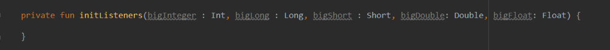

# Android code style(Kotlin)

### Content
1. [Source files](#source_files)
    - [Naming](#source_files_naming)
    - [Special Characters](#source_files_special_characters)
    - [File structure](#source_files_structure)
    - [Package structure](#source_files_package_structure)
    - [Class structure](#source_files_class_structure)
2. [Formatting](#formatting)
    - [Braces](#formatting_braces)
    - [Indentation](#formatting_indentation)
    - [One statement per line](#formatting_one_statement_per_line)
    - [Line wrapping](#formatting_line_wrapping)
    - [Whitespace](#formatting_whitespace)
    - [Specific constructs](#formatting_specific_constructs)
3. [Naming](#naming)
    - [Package Names](#naming_package_names)
    - [Type names](#naming_type_names)
    - [Function names](#naming_function_names)
    - [Constant names](#naming_constant_names)
    - [Acronyms](#naming_acronyms)
4. [Documentation](#documentation)
    - [Formatting](#documentation_formatting)
    - [Usage](#documentation_usage)


<a id="source_files"><h2>Source files</h2></a>

  <a id="source_files_naming"><h3>Naming</h3></a>
  If a source file contains only a single top-level class, the file name should reflect the case-sensitive name plus the ```.kt``` extension. Otherwise, if a source file contains multiple top-level declarations, choose a name that describes the contents of the file, apply PascalCase, and append the ```.kt``` extension.
  ```java
  /* The file name must be HomeActivity.kt */
  class HomeActivity {
    // ...
  }
  ```
  <a id="source_files_special_characters"><h3>Special Characters</h3></a>
    <h4>Whitespace characters</h4>
    Aside from the line terminator sequence, the ASCII horizontal space character (0x20) is the only whitespace character that appears anywhere in a source file.<br>
    This implies that:
      - All other whitespace characters in string and character literals are escaped.
      - Tab characters are not used for indentation.
    <h4>Special escape sequences</h4>
    For any character that has a special escape sequence (```\b```, ```\n```, ```\r```, ```\t```, ```\'```, ```\"```, ```\\```, and ```\$```), that sequence is used rather than the corresponding Unicode (e.g., ```\u000a```) escape.
    <h4>Non-ASCII characters</h4>
    For the remaining non-ASCII characters, either the actual Unicode character (e.g., ```∞```) or the equivalent Unicode escape (e.g., ```\u221e```) is used. The choice depends only on which makes the code easier to read and understand. Unicode escapes are discouraged for printable characters at any location and are strongly discouraged outside of string literals and comments.
    
   | Example                                | Discussion                                                               |
   |:--------------------------------------:|:------------------------------------------------------------------------:|
   | ```val unitAbbrev = "μs"```            | Best: perfectly clear even without a comment.                            |
   | ```val unitAbbrev = "\u03bcs" // μs``` | Poor: there’s no reason to use an escape with a printable character      |
   | ```val unitAbbrev = "\u03bcs" ```      | Poor: the reader has no idea what this is.                               |
   | ```return "\ufeff" + content```        | Good: use escapes for non-printable characters, and comment if necessary.|
    
  <a id="source_files_structure"><h3>File structure</h3></a>
  
  A ```.kt``` file comprises of the following, in order:
  - Copyright and/or license header (optional)
  - File-level annotations
  - Package statement
  - Import statements
  - Top-level declarations
    
Exactly one blank line separates each of these sections.
  <h4>Copyright / License</h4>
  If a copyright or license header belongs in the file it should be placed at the immediate top in a multi-line comment.<br>
  For example:
  
  ```java
  /*
   * Copyright 2017 Google, Inc.
   *
   * ...
   */
  ```
  
  Do not use a KDoc-style or single-line-style comment.
  <h4>File-level annotations</h4>
  Annotations with the ‘file’ use-site target are placed between any header comment and the package declaration.
  <h4>Package statement</h4>
  The package statement is not subject to any column limit and is never line-wrapped.
  <h4>Import statements</h4>
  Import statements for classes, functions, and properties are grouped together in a single list and ASCII sorted.<br>
  Wildcard imports (of any type) are not allowed.<br>
  Similar to the package statement, import statements are not subject to a column limit and they are never line-wrapped.
  <h4>Top-level declarations</h4>
  
  A ```.kt``` file can declare one or more types, functions, properties, or type aliases at the top-level.<br>
  The contents of a file should be focused on a single theme. Examples of this would be a single public type or a set of extension functions performing the same operation on multiple receiver types. Unrelated declarations should be separated into their own files and public declarations within a single file should be minimized.<br>
  No explicit restriction is placed on the number nor order of the contents of a file.<br>
  Source files are usually read from top-to-bottom meaning that the order, in general, should reflect that the declarations higher up will inform understanding of those farther down. Different files may choose to order their contents differently. Similarly, one file may contain 100 properties, another 10 functions, and yet another a single class.<br>
  What is important is that each class uses some logical order, which its maintainer could explain if asked. For example, new functions are not just habitually added to the end of the class, as that would yield “chronological by date added” ordering, which is not a logical ordering.
  <h4>Class member ordering</h4>
  The order of members within a class follow the same rules as the top-level declarations.
  
  <a id="source_files_package_structure"><h3>Package structure</h3></a>
  
  In mixed-language projects, Kotlin source files should reside in the same source root as the Java source files, and follow the same directory structure (each file should be stored in the directory corresponding to each package statement).<br>
  In pure Kotlin projects, the recommended directory structure is to follow the package structure with the common root package omitted (e.g. if all the code in the project is in the ```org.example.kotlin``` package and its subpackages, files with the ```org.example.kotlin``` package should be placed directly under the source root, and files in ```org.example.kotlin.foo.bar``` should be in the ```foo/bar``` subdirectory of the source root).
  
  <a id="source_files_class_structure"><h3>Class structure</h3></a>
  
  Generally, the contents of a class is sorted in the following order:
  - Property declarations and initializer blocks;
  - Secondary constructors;
  - Method declarations;
  - Companion object.
  
  Do not sort the method declarations alphabetically or by visibility, and do not separate regular methods from extension methods. Instead, put related stuff together, so that someone reading the class from top to bottom would be able to follow the logic of what's happening. Choose an order (either higher-level stuff first, or vice versa) and stick to it.<br>
  Put nested classes next to the code that uses those classes. If the classes are intended to be used externally and aren't referenced inside the class, put them in the end, after the companion object.
  
<a id="formatting"><h2>Formatting</h2></a>

  <a id="formatting_braces"><h3>Braces</h3></a>
  
  Braces are not required for ```when``` branches and ```if``` statement bodies which have no ``else if`` / ``else`` branches and which fit on a single line.<br>
  For example:
  ```java
  if(TextUtils.isEmpty(inputId?.text)) dbResultPresenter?.execute()
  ```
  Braces are otherwise required for any if, for, when branch, do, and while statements, even when the body is empty or contains only a single statement.
  For example:
  ```java
  // NO
  if(TextUtils.isEmpty(inputId?.text))
      dbResultPresenter?.execute()
      
  // YES
  if(TextUtils.isEmpty(inputId?.text)){
      dbResultPresenter?.execute()
  }
  ```
  <h4>Empty blocks</h4>
  An empty block or block-like construct must be in K&R style.<br>
  For example:
  
  ```java
  // NO
  try {
      App.getSnappyDBSession()
              .put("android:" + i.toString(), generateEntity(0))
  } catch (e: SnappydbException) {}
  
  // YES
  try {
      App.getSnappyDBSession()
              .put("android:" + i.toString(), generateEntity(0))
  } catch (e: SnappydbException) {
  }
  ```
  <a id="formatting_indentation"><h3>Indentation</h3></a>
  
  Each time a new block or block-like construct is opened, the indent increases by four spaces. When the block ends, the indent returns to the previous indent level. The indent level applies to both code and comments throughout the block.
  
  <a id="formatting_one_statement_per_line"><h3>One statement per line</h3></a>
  
  Each statement is followed by a line break. Semicolons are not used.
  
  <a id="formatting_line_wrapping"><h3>Line wrapping</h3></a>
  
  Code has a column limit of 100 characters. Except as noted below, any line that would exceed this limit must be line-wrapped, as explained below.<br>
  For example:
  
  
  Exceptions:
  - Lines where obeying the column limit is not possible (for example, a long URL in KDoc).
  - ```package``` and ```import``` statements.
  - Command lines in a comment that may be cut-and-pasted into a shell.
  
  <h4>Continuation indent</h4>
  When line-wrapping, each line after the first (each continuation line) is indented at least +8 from the original line.<br>
  When there are multiple continuation lines, indentation may be varied beyond +8 as desired. In general, two continuation lines use the same indentation level if and only if they begin with syntactically parallel elements.
  
  <h4>Functions</h4>
  
  When a function signature does not fit on a single line, break each parameter declaration onto its own line. Parameters defined in this format should use a continuation indent (+8). The closing parenthesis (```)```) and return type are placed on their own line with no additional indent.<br>
  
  For example:<br>
  __NO__:
  
  __YES__:
  
  
  When a function contains only a single expression it can be represented as an expression function.<br>
  For example:
  ```java
  fun toString(): String {
    return "Hello world!"
  }
  ```
  ```java
  fun toString(): String = "Hello world!"
  ```
  
  <h4>Properties</h4>
  
  When a property initializer does not fit on a single line, break after the equals sign (```=```) and use a continuation indent(+8).
  
  For example:<br>
  __NO__:
  
  __YES__:
  
  
  <a id="formatting_whitespace"><h3>Whitespace</h3></a>
  
  <h4>Vertical</h4>
  
  A single blank line appears:
  - Between consecutive members of a class: properties, constructors, functions, nested classes, etc.
    - Exception: A blank line between two consecutive properties (having no other code between them) is optional. Such blank lines are used as needed to create logical groupings of properties and associate properties with their backing property, if present.
    - Exception: Blank lines between enum constants are covered below.
  - Between statements, as needed to organize the code into logical subsections.
  - Optionally before the first statement in a function, before the first member of a class, or after the last member of a class (neither encourage nor discouraged).
  - As required by other sections of this document (Such as the “Structure” section).

Multiple consecutive blank lines are permitted, but not encouraged or ever required.
  <h4>Horizontal</h4>
  
  A single ASCII space also appears in the following places only:
  - Separating any reserved word, such as ```else``` or ```catch```, from a closing curly brace (```}```) that precedes it on that line:
  ```java
  // NO
  }else {
  }
  
  // YES
  } else {
  }
  ```
  - Separating any reserved word, such as ```if```, ```for```, or ```catch``` from an open parenthesis (```(```) that follows it on that line:
  ```java
  // NO
  for(i in 0..1) {
  }
  
  // YES
  for (i in 0..1) {
  }
  ```
  - Before any open curly brace (```{```):
  ```java
  // NO
  if (list.isEmpty()){
  }
  
  // YES
  if (list.isEmpty()) {
  }
  ```
  - On both sides of any binary operator:
  ```java
  // NO
  val two = 1+1
  
  // YES
  val two = 1 + 1
  ```
  But not the two colons (```::```) of a member reference and the dot separator (```.```).
  - Before a colon (```:```) only if used in a class declaration for specifying a base class / interfaces:
  ```java
  // NO
  class MyThread: Runnable {
      // ...
  }
  
  // YES
  class MyThread : Runnable {
      // ...
  }
  ```
  - After a comma (```,```) or colon (```:```):
  ```java
  // NO
  val sum = getSum(1,2)
  
  // YES
  val sum = getSum(1, 2)
  ```
  - On both sides of the double slash (```//```) that begins an end-of-line comment:
  ```java
  //NO
  
  // YES
  ```
  <a id="formatting_specific_constructs"><h3>Specific constructs</h3></a>
  
  <h4>Enum classes</h4>
  An enum with no functions and no documentation on its constants may optionally be formatted as a single line.<br>
  When the constants in an enum are placed on separate lines, a blank line is not required between them except in the case where they define a body.<br>
  Since enum classes are classes, all other rules for formatting classes apply.
  
  <h4>Annotations</h4>
  Member or type annotations are placed on separate lines immediately prior to the annotated construct.<br>
  Annotations without arguments can be placed on a single line.<br>
  When only a single annotation without arguments is present it may be placed on the same line as the declaration.
  
<a id="naming"><h2>Naming</h2></a>

Identifiers use only ASCII letters and digits, and, in a small number of cases noted below, underscores. Thus each valid identifier name is matched by the regular expression ```\w+```.<br>
Special prefixes or suffixes, like those seen in the examples ```name_```, ```mName```, ```s_name```, and ```kName```, are not used except in the case of backing properties.
  <a id="naming_package_names"><h3>Package Names</h3></a>
  
  Package names are all lowercase, with consecutive words simply concatenated together (no underscores).<br>
  For example:
  ```java
  // NO
  package com.litosh.ilya_packageOne
  
  // YES
  package com.litosh.ilyapackageone
  ```
  <a id="naming_type_names"><h3>Type names</h3></a>
  
  Class names are written in PascalCase and are typically nouns or noun phrases. For example, ```Character``` or ```ImmutableList```. Interface names may also be nouns or noun phrases, but may sometimes be adjectives or adjective phrases instead.<br>
  Test classes are named starting with the name of the class they are testing, and ending with ```Test```. For example, ```HashTest``` or ```HashIntegrationTest```.
  
  <a id="naming_function_names"><h3>Function names</h3></a>
  
  Function names are written in camelCase and are typically verbs or verb phrases. For example, ```sendMessage``` or ```stop```.<br>
  Underscores are permitted to appear in test function names to separate logical components of the name.<br>
  For example:
  ```java
  @Test fun ensureEverythingWorks_onAndroid() {
      // ...
  }
  ```
  
  <a id="naming_constant_names"><h3>Constant names</h3></a>
  
  Constant names use UPPER_SNAKE_CASE: all uppercase letters, with words separated by underscores.<br>
  Names are typically nouns or noun phrases.<br>
  Constants which are scalar values must use the ```const``` modifier.<br>
  For example:
  ```java
  const val NUMBER = 5
  val NAMES = listOf("Alice", "Bob")
  val AGES = mapOf("Alice" to 35, "Bob" to 32)
  val COMMA_JOINER = Joiner.on(',') // Joiner is immutable
  val EMPTY_ARRAY = arrayOf<SomeMutableType>()
  ```

  <a id="naming_acronyms"><h3>Acronyms</h3></a>
  
  Abbreviations and acronyms should be written as words.<br>
  For example:
  
  | Prose form                 | Correct               | Incorrect                        |
  |:--------------------------:|:---------------------:|:--------------------------------:|
  | “XML Http Request”         | XmlHttpRequest        | XMLHTTPRequest                   |
  | “new customer ID”          | newCustomerId         | newCustomerID                    |
  | “supports IPv6 on iOS”     | supportsIpv6OnIos     | supportsIPv6OnIOS                |
  
<a id="documentation"><h2>Documentation</h2></a>  

  <a id="documentation_formatting"><h3>Formatting</h3></a>
  
  The basic formatting of KDoc blocks is seen in this example.<br>
  For example:
  
  ```java
  /**
   * Multiple lines of 
   * KDoc text, 
   */
  fun method(arg: String) {
      // …
  }
  
  /** Single line of KDoc text,  */
  fun method(arg: String) {
      // …
  }
  ```
  The basic form is always acceptable. The single-line form may be substituted when the entirety of the KDoc block (including comment markers) can fit on a single line. Note that this only applies when there are no block tags such as ```@return```
  
  <a id="documentation_usage"><h3>Usage</h3></a>
  
  At the minimum, KDoc is present for every ```public``` type, and every ```public``` or ```protected``` member of such a type, with a few exceptions noted below.
  
